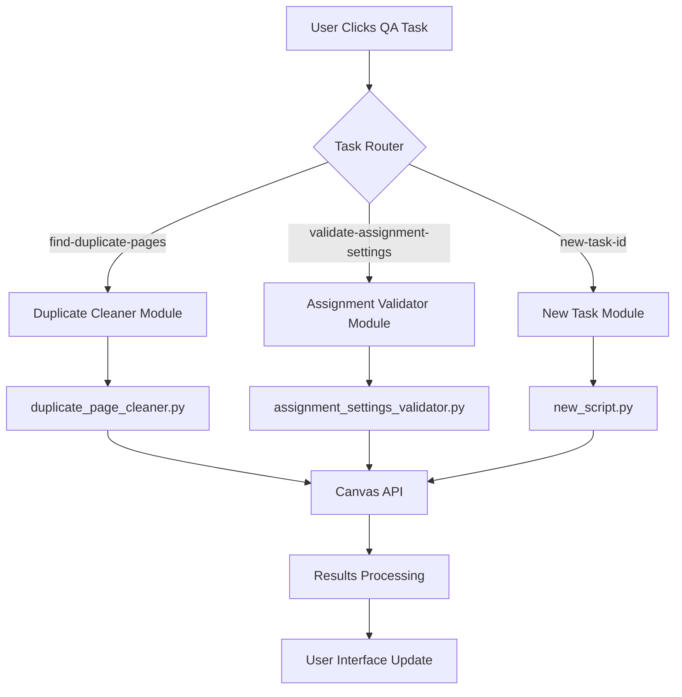

# Canvas LTI QA Automation - Architecture Documentation

**Version:** 2.0  
**Purpose:** Modular QA task integration without breaking existing functionality  
**Status:** **CRITICAL REFERENCE** - Consult before any development

---

## 🏗️ **Architecture Overview**

The LTI QA Automation system follows a **strict modular architecture** where each QA task operates as an independent module. This ensures that adding new tasks never breaks existing functionality.

### **Core Principles:**
1. **Additive Development** - Only add, never modify existing code
2. **Modular Isolation** - Each task is completely independent
3. **Consistent Patterns** - Follow established conventions exactly
4. **Safety First** - Existing workflows must remain unchanged

### Guiding Principle (apply on every new standalone script integration)
**Deep Analysis + Strict Architecture + Thoughtful Enhancement**
- Deep Analysis maps functionality and Canvas API usage before coding
- Strict Architecture enforces the preview-first, two-mode flow and JSON contracts
- Thoughtful Enhancement adds HCD safety/UX, guardrails, and robust error handling

---

## 📂 **File Structure (DO NOT MODIFY EXISTING FILES)**

```
qa-automation-lti/
├── qa-automation-lti.js          # Main LTI file
├── scripts/                      # Python scripts directory
│   ├── duplicate_page_cleaner.py # 🚨 NEVER MODIFY - existing script
│   └── [new_script].py          # ✅ ADD NEW - separate files only
├── temp/                         # Auto-generated temporary files
├── public/                       # Static assets (if needed)
├── .cursorrules                  # This safety rules file
├── LTI-QA-Architecture.md        # This documentation
└── package.json                  # Node.js dependencies
```

---

## 🔄 **Data Flow Architecture**



**Key Points:**
- Each module is completely isolated
- No shared state between modules
- Independent error handling per module
- Canvas API calls are module-specific

---

## 🎯 **Task Integration Pattern (MANDATORY)**

### **1. Task Definition (qa-automation-lti.js)**
```javascript
// ADD to QA_TASKS object - NEVER modify existing entries
const QA_TASKS = {
  'find-duplicate-pages': {
    // 🚨 EXISTING - DO NOT TOUCH
    name: 'Find and Remove Duplicate Pages',
    description: 'Identify and remove duplicate page content using Canvas API and content analysis',
    category: 'Content Management',
    mvp: true
  },
  
  // ✅ ADD NEW TASKS HERE
  'validate-assignment-settings': {
    name: 'Validate Assignment Settings',
    description: 'Check assignment points, grading types, submission settings, and ensure QA compliance',
    category: 'Assignment Quality',
    mvp: true
  }
}
```

### **2. Analysis Function Extension**
```javascript
// ADD new case to analyzeTask function - NEVER modify existing cases
async function analyzeTask(taskId, courseId, userId) {
  switch (taskId) {
    case 'find-duplicate-pages':
      // 🚨 EXISTING LOGIC - DO NOT MODIFY
      return existingDuplicatePageLogic();
      
    case 'validate-assignment-settings':
      // ✅ ADD NEW LOGIC HERE
      return newAssignmentValidationLogic();
      
    default:
      throw new Error(`Unknown task: ${taskId}`)
  }
}
```

### **3. Execution Function Extension**
```javascript
// ADD new case to executeApprovedActions function
async function executeApprovedActions(taskId, courseId, userId, approvedActions) {
  switch (taskId) {
    case 'find-duplicate-pages':
      // 🚨 EXISTING LOGIC - DO NOT MODIFY
      return existingDuplicateExecutionLogic();
      
    case 'validate-assignment-settings':
      // ✅ ADD NEW LOGIC HERE
      return newAssignmentExecutionLogic();
      
    default:
      throw new Error(`Unknown task: ${taskId}`)
  }
}
```

---

## 🐍 **Python Script Integration Pattern**

### **New Script Template (CREATE NEW FILE ONLY)**
```python
"""
New QA Script - LTI Enhanced Version
- Follow this exact pattern for LTI integration
- Never modify existing Python scripts
"""

import argparse
import json
import sys

class NewQAValidator:
    def __init__(self, base_url: str, api_token: str):
        # Your initialization code
        pass
    
    def analyze_course(self, course_id: str) -> List[Dict]:
        # Your analysis logic
        pass
    
    def execute_fixes(self, course_id: str, approved_fixes: List[Dict]) -> Dict:
        # Your execution logic
        pass

def main():
    # MANDATORY: Include these arguments for LTI integration
    parser = argparse.ArgumentParser()
    parser.add_argument('--canvas-url', required=True)
    parser.add_argument('--api-token', required=True) 
    parser.add_argument('--course-id', required=True)
    
    # Phase 2: Enhanced arguments for LTI integration
    parser.add_argument('--analyze-only', action='store_true')
    parser.add_argument('--execute-approved', type=str)
    parser.add_argument('--risk-assessment', action='store_true')
    
    args = parser.parse_args()
    
    # Your script logic here
    
    if args.execute_approved:
        # Execute approved actions mode
        execution_results = {
            "execution_complete": True,
            "successful_fixes": [],
            "failed_fixes": [],
            "summary": {}
        }
        print("EXECUTION_RESULTS_JSON:", json.dumps(execution_results))
    else:
        # Analysis mode
        enhanced_output = {
            "phase": 2,
            "mode": "preview_first",
            "analysis_complete": True,
            "findings": {
                "safe_actions": [],
                "requires_manual_review": []
            },
            "risk_assessment": {}
        }
        print("ENHANCED_ANALYSIS_JSON:", json.dumps(enhanced_output))

if __name__ == "__main__":
    main()
```

---

## 🎨 **Frontend Integration Pattern**

### **JavaScript Function Naming (NEVER MODIFY EXISTING)**
```javascript
// 🚨 EXISTING FUNCTIONS - DO NOT MODIFY
function generateDuplicateAnalysisPreview() { /* existing */ }
function generateEnhancedDuplicateResults() { /* existing */ }
function executeSafeActions() { /* existing */ }

// ✅ NEW FUNCTIONS - UNIQUE NAMES ONLY
function generateAssignmentAnalysisPreview() { /* new */ }
function generateEnhancedAssignmentResults() { /* new */ }
function executeAssignmentSafeActions() { /* new */ }
```

### **UI Function Extension Pattern**
```javascript
// EXTEND showAnalysisPreview function - ADD new cases only
function showAnalysisPreview(taskId) {
    if (taskId === 'find-duplicate-pages') {
        // 🚨 EXISTING - DO NOT MODIFY
        title.textContent = 'Phase 2: Enhanced Duplicate Analysis Preview';
        content.innerHTML = generateDuplicateAnalysisPreview();
    } else if (taskId === 'validate-assignment-settings') {
        // ✅ ADD NEW CASE
        title.textContent = 'Phase 2: Assignment Settings Validation Preview';
        content.innerHTML = generateAssignmentAnalysisPreview();
    }
    // Add more cases as needed
}
```

---

## 🛡️ **Safety Validation Checklist**

Before implementing any new QA task, verify:

### **Pre-Development:**
- [ ] Reviewed existing code to understand patterns
- [ ] Identified exact integration points
- [ ] Planned unique naming conventions
- [ ] Confirmed no existing file modifications needed

### **During Development:**
- [ ] Creating new Python script file (not modifying existing)
- [ ] Adding new cases to switch statements (not modifying existing)
- [ ] Using unique function names for frontend
- [ ] Following established error handling patterns

### **Post-Development Testing:**
- [ ] Existing duplicate page cleaner works unchanged
- [ ] New task works independently
- [ ] Can switch between tasks without issues
- [ ] No JavaScript console errors
- [ ] No Python import conflicts
- [ ] All Canvas API calls work properly

### **Deployment Readiness:**
- [ ] All tests pass
- [ ] Code review completed
- [ ] Documentation updated
- [ ] No breaking changes introduced

---

## 🔧 **Common Integration Points**

### **1. Task Registration**
**Location:** `QA_TASKS` object  
**Action:** ADD new entry  
**Never:** Modify existing entries

### **2. Analysis Logic**
**Location:** `analyzeTask()` function  
**Action:** ADD new case to switch statement  
**Never:** Modify existing cases

### **3. Execution Logic**
**Location:** `executeApprovedActions()` function  
**Action:** ADD new case to switch statement  
**Never:** Modify existing cases

### **4. Frontend Functions**
**Location:** JavaScript section  
**Action:** CREATE new functions with unique names  
**Never:** Modify existing functions

### **5. Progress Messages**
**Location:** `showProgress()` function  
**Action:** ADD new task to progressMessages object  
**Never:** Modify existing messages

---

## 📈 **Scalability Guidelines**

### **Adding More QA Tasks:**
1. Follow the exact same pattern for each new task
2. Each task gets its own Python script
3. Each task gets its own UI functions
4. Each task operates completely independently

### **Maintaining Code Quality:**
1. Use consistent naming conventions
2. Follow established error handling patterns
3. Maintain comprehensive documentation
4. Implement thorough testing for each task

### **Performance Considerations:**
1. Each task should handle its own timeouts
2. Use appropriate Canvas API rate limiting
3. Implement efficient progress reporting
4. Clean up temporary files properly

---

## 🚨 **Critical Warnings**

### **NEVER DO THIS:**
- Modify existing Python script files
- Change existing JavaScript function implementations
- Alter existing task IDs or names
- Remove or rename existing API endpoints
- Share state between different QA tasks
- Skip the preview-first workflow
- Auto-execute changes without user approval

### **ALWAYS DO THIS:**
- Create new files for new functionality
- Use unique naming for all new components
- Follow existing patterns exactly
- Test thoroughly before deployment
- Maintain backward compatibility
- Document all changes clearly

---

**Remember: This architecture is designed for safety and scalability. Following these patterns ensures that the LTI system can grow with new QA tasks while maintaining reliability and user trust.**